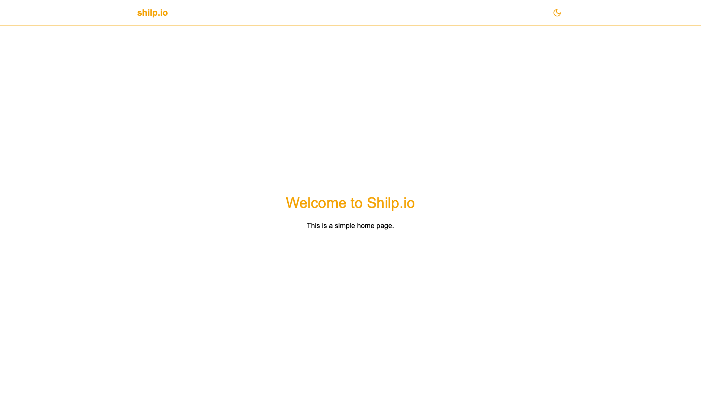
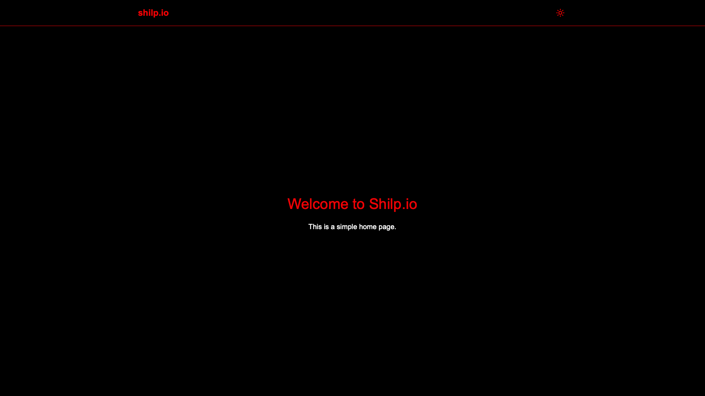

# Frontend Shilp.io

**React + TypeScript + Vite**
- with Tailwind and Sass
- Simple Chatbot interface

## Light Mode


## Dark Mode


## Prerequisites

- [Bun](https://bun.sh/) installed on your system

## Getting Started

To clone and set up the project using Bun:

```bash
# Clone the repository
git clone https://github.com/shilp-io/frontend.git
cd frontend

# Install dependencies
bun install

# Start the development server
bun run dev
```

## Available Scripts

In the project directory, you can run:

### `bun run dev`

Runs the app in development mode.\
Open [http://localhost:5173](http://localhost:5173) to view it in the browser.

### `bun run build`

Builds the app for production to the `dist` folder.

### `bun run preview`

Previews the built app locally.

## Using Bun Instead of npm/npx

Bun can replace both npm and npx in most scenarios. Here are some common commands:

### Installing Dependencies

Instead of `npm install`:
```bash
bun install
```

To add a new dependency:
```bash
bun add <package-name>
```

To add a dev dependency:
```bash
bun add -d <package-name>
```

### Running Scripts

Instead of `npm run <script>`:
```bash
bun run <script>
```

### Executing Packages

Instead of `npx <package>`:
```bash
bunx <package>
```

### Updating Dependencies

To update all dependencies:
```bash
bun update
```

To update a specific package:
```bash
bun update <package-name>
```

## Additional Bun Features

- **Fast Package Installation**: Bun's package manager is significantly faster than npm.
- **TypeScript Support**: Bun has built-in TypeScript support.
- **Built-in Testing**: Use `bun test` to run tests.
- **File Watching**: Use `bun --watch` for file watching during development.

## Expanding the ESLint configuration

When developing a production application, update the configuration to enable type aware lint rules:

1. Configure the top-level `parserOptions` property like this:

```js
export default tseslint.config({
  languageOptions: {
    // other options...
    parserOptions: {
      project: ['./tsconfig.node.json', './tsconfig.app.json'],
      tsconfigRootDir: import.meta.dirname,
    },
  },
})
```

2. Replace `tseslint.configs.recommended` to `tseslint.configs.recommendedTypeChecked` or `tseslint.configs.strictTypeChecked`
3. Optionally add `...tseslint.configs.stylisticTypeChecked`
4. Install [eslint-plugin-react](https://github.com/jsx-eslint/eslint-plugin-react) and update the config:

```js
// eslint.config.js
import react from 'eslint-plugin-react'
export default tseslint.config({
  // Set the react version
  settings: { react: { version: '18.3' } },
  plugins: {
    // Add the react plugin
    react,
  },
  rules: {
    // other rules...
    // Enable its recommended rules
    ...react.configs.recommended.rules,
    ...react.configs['jsx-runtime'].rules,
  },
})
```

## Learn More

To learn more about the technologies used in this project:

- [Bun Documentation](https://bun.sh/docs)
- [React Documentation](https://reactjs.org/)
- [Vite Documentation](https://vitejs.dev/)
- [TypeScript Documentation](https://www.typescriptlang.org/docs/)
- [Tailwind CSS Documentation](https://tailwindcss.com/docs)
- [Sass Documentation](https://sass-lang.com/documentation)

## Contributing

Pull requests are welcome. For major changes, please open an issue first to discuss what you would like to change.

## License

[MIT](https://choosealicense.com/licenses/mit/)
